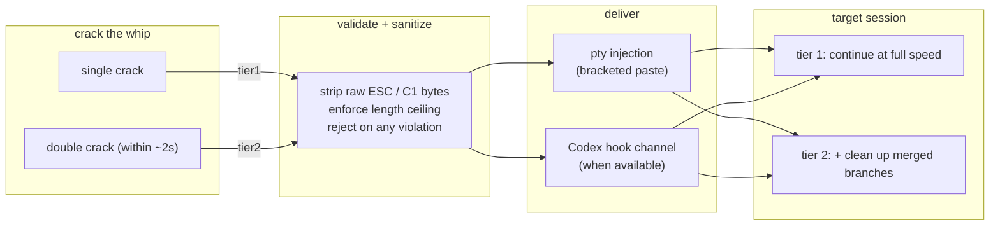

# agent-whip


Crack a whip at a running AI coding agent session and it switches into a
faster operating mode.

- **Single crack** → speed mode.
- **Double crack** (two within ~2 seconds) → speed mode **plus** cleanup
  authorization.
- No confirmation prompt, on either tier — see
  [why that's deliberate](#why-this-is-not-an-interrupt).
- No network access, no telemetry, no real trigger phrases in this
  repository — see [Privacy](docs/features/privacy.md).

```
npm install -g agent-whip
agent-whip crack           # tier 1: speed mode
agent-whip crack --double  # tier 2: speed mode + cleanup authorization
```

> [!NOTE]
> `agent-whip` is not yet published to npm. The install line above is the
> target interface — see `ROADMAP.md` for what is actually shipped today.

## Contents

- [Why this is not an interrupt](#why-this-is-not-an-interrupt)
- [How a crack lands](#how-a-crack-lands)
- [Prior art](#prior-art)
- [Documentation](#documentation)
- [Install](#install-details) (folded)
- [Configuration](#configuration) (folded)
- [Delivery routes](#delivery-routes-1) (folded)
- [Security](#security) (folded)
- [Development](#development) (folded)
- [Screenshots](#screenshots) (folded)

## Why this is not an interrupt

`agent-whip`'s ancestor is
[OpenWhip](https://github.com/GitFrog1111/OpenWhip) — an Electron tray app
you click, which drops a whip overlay and sends an interrupt (`Ctrl-C`) plus
one of five encouraging messages. It is a joke, and a good one; its own
roadmap jokes about a cease-and-desist letter arriving. We mean that warmly:
`agent-whip` exists because the bit was too good not to actually build
properly.

But an interrupt-based whip has a real problem hiding under the joke: **it
makes the agent slower.** `Ctrl-C` discards whatever the agent was mid-turn
on. The "motivational" message that follows does not resume that work — it
starts a new turn from scratch. Every crack costs the agent the entire
in-flight response. A whip that is supposed to make an agent go faster
instead makes it re-do work it had already started.

`agent-whip` inverts the payload. A crack does not interrupt anything — it
**injects a short trigger phrase** into the live session, timed and framed
so the agent reads it as ordinary input, not a signal to abandon its current
turn. The phrase switches the agent into a faster operating mode (see
`docs/features/payload-profiles.md`) by asking for exactly that, in
words, the way you would type it yourself. No discarded turn, no interrupt
signal, no work thrown away.



## How a crack lands

1. You crack (once, or twice within ~2 seconds).
2. `agent-whip` resolves the payload for that tier — either the shipped
   neutral defaults, or your own phrases from a local, never-committed
   `~/.agent-whip/profile.json` (see
   [Payload profiles](docs/features/payload-profiles.md)).
3. The payload is validated and sanitized — a fixed length ceiling, and a
   hard rejection of anything containing a raw `ESC` or C1 control byte, so
   a malformed payload can never break out of its delivery frame (see
   `SECURITY.md`).
4. It is delivered to a specific, unambiguously identified target window or
   channel — never a guess (see
   [Delivery routes](docs/features/delivery-routes.md)).
5. The crack is recorded in a local, append-only log — timestamp, tier,
   route, outcome. Never the payload text (see
   [Privacy](docs/features/privacy.md)).

## Prior art

[OpenWhip](https://github.com/GitFrog1111/OpenWhip) is the direct
inspiration for this project, right down to the name. It is a small, funny
Electron app: click a tray icon, a whip overlay drops, and the agent gets a
`Ctrl-C` plus an encouraging message pulled from a list of five. Its README
and roadmap are self-aware about being a bit — including joking about the
cease-and-desist it half-expects.

`agent-whip` is the earnest version of the same gag: same premise (whip
metaphor, crack to motivate an agent), opposite mechanism. Where OpenWhip
interrupts and restarts, `agent-whip` injects and continues. If you like
the joke, you will probably like both projects for different reasons — go
give OpenWhip a star too.

## Documentation

Full documentation lives in [`docs/`](docs/README.md):

- [Payload profiles](docs/features/payload-profiles.md)
- [Crack tiers](docs/features/crack-tiers.md)
- [Delivery routes](docs/features/delivery-routes.md)
- [Privacy](docs/features/privacy.md)

Also see [`ROADMAP.md`](ROADMAP.md), [`SECURITY.md`](SECURITY.md), and
[`CONTRIBUTING.md`](CONTRIBUTING.md).

<details>
<summary><h2 id="install-details">Install</h2></summary>

Not yet published. Once it is:

```
npm install -g agent-whip
```

For now, clone and build from source:

```
git clone https://github.com/agent-whip/agent-whip.git
cd agent-whip
npm install
npm run build
```

See [Development](#development) below for the full local loop, including
the guard scripts that keep this repository's privacy contract enforced.

</details>

<details>
<summary><h2 id="configuration">Configuration</h2></summary>

`agent-whip` reads an optional local profile from
`~/.agent-whip/profile.json`:

```json
{
  "version": 1,
  "tier1": "your own tier-1 phrase here",
  "tier2": "your own tier-2 phrase here"
}
```

If this file does not exist, or fails schema validation, `agent-whip` falls
back to its shipped neutral defaults (`continue at full speed` /
`continue at full speed, then clean up merged branches`). This file is
**never** read from or written into this repository, and this repository's
`.gitignore` and `check-public-hygiene` guard both refuse to let a
`profile.json` become a tracked file even by accident.

Full details: [Payload profiles](docs/features/payload-profiles.md).

</details>

<details>
<summary><h2 id="delivery-routes-1">Delivery routes</h2></summary>

- **Pty injection** — the general-purpose route. Works against any shell or
  TUI that honors bracketed paste.
- **Codex hook channel** — used when the target is a Slop Machine (OpenAI
  Codex CLI) session with a hook/session channel available; falls back to
  pty injection otherwise.
- **Standalone dispatcher GUI** — planned (see `ROADMAP.md` milestone 6).

Every route shares the same window-targeting contract: a target is resolved
by class **and** a non-empty title **and** non-zero dimensions. Ambiguous or
zero matches are refused, never guessed at.

Full details: [Delivery routes](docs/features/delivery-routes.md).

</details>

<details>
<summary><h2 id="security">Security</h2></summary>

- The bracketed-paste escape-out hazard, and how the sanitizer answers it.
- No network access, anywhere in this codebase (enforced by
  `scripts/check-no-network.mjs`).
- No payload text ever reaches a log (enforced by
  `scripts/check-no-payload-logging.mjs`).
- No committed local profile, ever (enforced by
  `scripts/check-public-hygiene.mjs`).
- Why there is no confirmation prompt before delivery, and what the
  mitigation actually is.

Full details, including how to report a vulnerability: [`SECURITY.md`](SECURITY.md).

</details>

<details>
<summary><h2 id="development">Development</h2></summary>

```
npm install
npm run build
npm run typecheck
npm run check   # runs all three privacy/safety guard scripts
```

The three guard scripts, individually:

```
npm run check:no-network          # packages/core, packages/cli must never touch a socket
npm run check:no-payload-logging  # payload text must never reach console.*
npm run check:public-hygiene      # no committed profile.json; no raw control bytes outside paste-frame
```

CI (`.github/workflows/ci.yml`) runs the build, typecheck, guard scripts, and
test suite on every push. By explicit house policy, GitHub Actions never
gates a merge on test or lint results — the test suite runs and reports, but
it is not a required status check. See the comment in that workflow file for
the full reasoning.

See [`CONTRIBUTING.md`](CONTRIBUTING.md) for the full contribution guide.

</details>

<details>
<summary><h2 id="screenshots">Screenshots</h2></summary>

Not yet available — there is no working CLI or dispatcher GUI to capture
yet. This section will carry real captures of a crack landing in a real
terminal once milestone 4 (pty injection) ships. See `ROADMAP.md`.

</details>

## License

[MIT](LICENSE)
